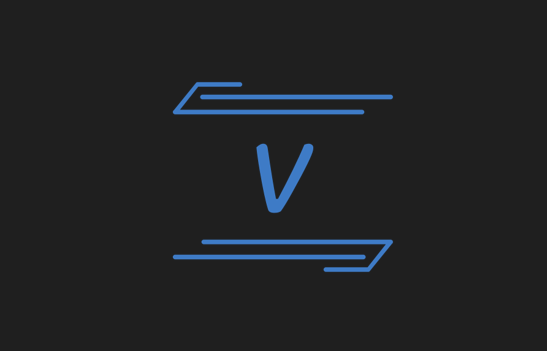

<p align="center">
    
    <h2 align="center">学习文档</h2>
</p>

> 本文档用于开发时遇到的问题使用的解决方案的说明!

## 🎯 代码检查

> 1. eslint 配置 vue3 、ts 检查
> 2. prettierrc 格式化代码
> 3. stylelint 检查less 样式代码

```shell
npm i
eslint
eslint-plugin-vue #检查vue单文件
eslint-config-prettier #来禁用所有与格式化相关的ESLint规则
@typescript-eslint/parser #一个ESLint解析器，它利用TypeScript ESTree来允许ESLint对TypeScript源代码进行lint。
@typescript-eslint/eslint-plugin
eslint-plugin-prettier #解决prettier 和 eslint 冲突,将Prettier作为ESLint规则，并将差异报告为单个ESLint问题。
vue-eslint-parser #用于检查 Vue.js 代码的规范性，包括模板、组件和指令等方面的检查。
eslint-plugin-node #Node.js的其他ESLint规则
eslint-plugin-import #支持ES 2015+（ES6+）导入/导出语法的linting，并防止文件路径和导入名称拼写错误的问题
prettier
stylelint #运行工具
stylelint-config-standard # stylelint的推荐配置
stylelint-order # 属性进行排序
postcss-less # 用于解析less
stylelint-config-standard-vue # 检查vue文件里的style
```

## ⚡主题色方案

> 1. 该方案主要用于，主题颜色不固定的场景，用户可自定义主题色!
> 2. 使用 css 全局变量 + less变量，js控制颜色变化。

#### 1. 定义全局变量的文件

- theme-color.less

```less
:root {
  --theme-color: #1890ff;
}

@theme-color:var (--theme-color);
```

#### 2. 在index.html 中引入 theme-color.less

```html
<!doctype html>
<html lang="en">
  <head>
    <meta charset="UTF-8" />
    <link rel="icon" href="/favicon.ico" />
    <meta name="viewport" content="width=device-width, initial-scale=1.0" />
    <title>vue-backend-template</title>
    <link rel="stylesheet" href="./src/styles/theme-color.less" />
  </head>
  <body>
    <div id="app"></div>
    <script type="module" src="/src/main.ts"></script>
  </body>
</html>
```

#### 3. 使用css 全局变量

```css
#app {
  color: var(--theme-color);
}
```

#### 4. 使用js 动态修改全局变量的value

```js
document
  .getElementsByTagName('body')[0]
  .style.setProperty('--theme-color', '#000000')
```

## 🌈 dark / light 切换

> 1. 使用body 切换class 进行改变颜色
> 2. 使用less 变量 + css全局变量

#### 1. 全局变量的文件

- theme-color.less

```less
:root {
  --theme-color: #1890ff;
}

.light-variable {
  --color: #000000;
  --background-color: #ffffff;
}

.dark-variable {
  --color: #ffffff;
  --background-color: #000000;
}
// 主题色
@theme-color:var (--theme-color);
//黑白切换字体颜色
@color:var (--color);
//黑白切换背景颜色
@bg-color:var (--background-color);
```

#### 2. 使用

```less
@import './styles/theme-color.less';
#app {
  color: @theme-color;
  background-color: @bg-color;
}
```

#### 3. 动态修改

```js
const changeTheme = () => {
  const bodyClassName = document.body.className
  console.log(bodyClassName)
  if (bodyClassName === 'light-variable') {
    document.body.className = 'dark-variable'
  } else {
    document.body.className = 'light-variable'
  }
}
```

## 🔸 ant-design-vue@4

#### 1. 安装

```shell
1. npm i ant-design-vue@4.x --save
```

#### 2.main.ts引入css

```css
import 'ant-design-vue/dist/reset.css';
```

#### 3. 自动按需引入组件

```shell
npm install unplugin-vue-components -D
```

#### 4. vite.config.ts

```ts
import { defineConfig } from 'vite'
import vue from '@vitejs/plugin-vue'
import { resolve } from 'path'
import eslint from 'vite-plugin-eslint'
import Components from 'unplugin-vue-components/vite'
import { AntDesignVueResolver } from 'unplugin-vue-components/resolvers'
export default defineConfig(() => {
  return {
    resolve: {
      alias: {
        '@': resolve(__dirname, './src'),
      },
    },
    css: {
      preprocessorOptions: {
        less: {
          math: 'always',
          additionalData: `@import "${resolve(__dirname, './src/styles/theme-color.less')}";`,
        },
      },
    },
    plugins: [
      vue(),
      eslint(),
      Components({
        resolvers: [
          AntDesignVueResolver({
            importStyle: false, // css in js
          }),
        ],
      }),
    ],
    build: {
      target: 'chrome63',
      chunkSizeWarningLimit: 2000,
    },
  }
})
```

## 🤟 响应式方案

#### 1. 方案一 媒体查询方案

- 当设备宽度最大是 768 时说明该设备是手机或者平板的竖屏，用一套样式
- 除此之外的就用 pc 的一套样式

```css
/**pc 和 平板宽屏 */

/** 手机和平板竖屏 */
@media screen and (max-width: 768px) {
  body {
    background-color: green;
  }
}
```
